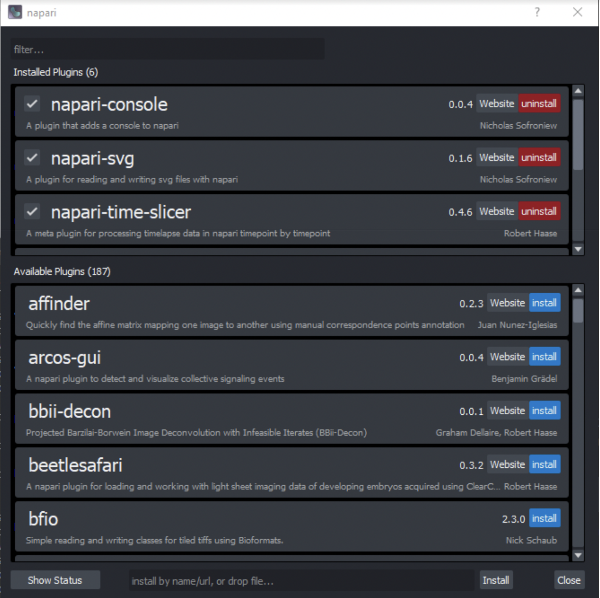
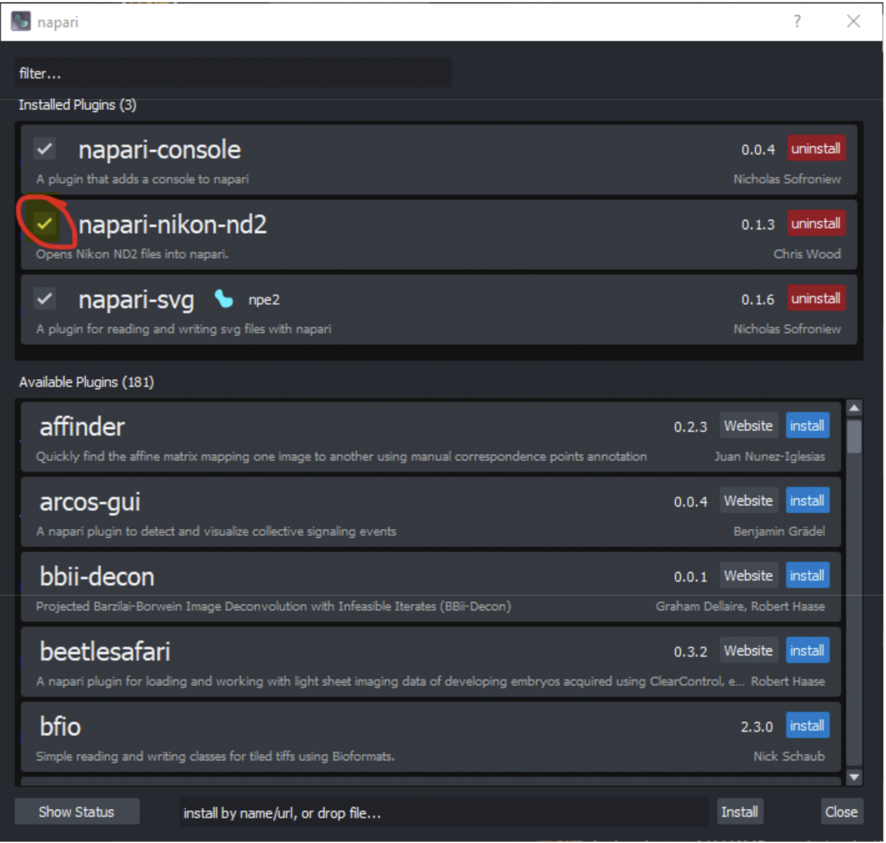
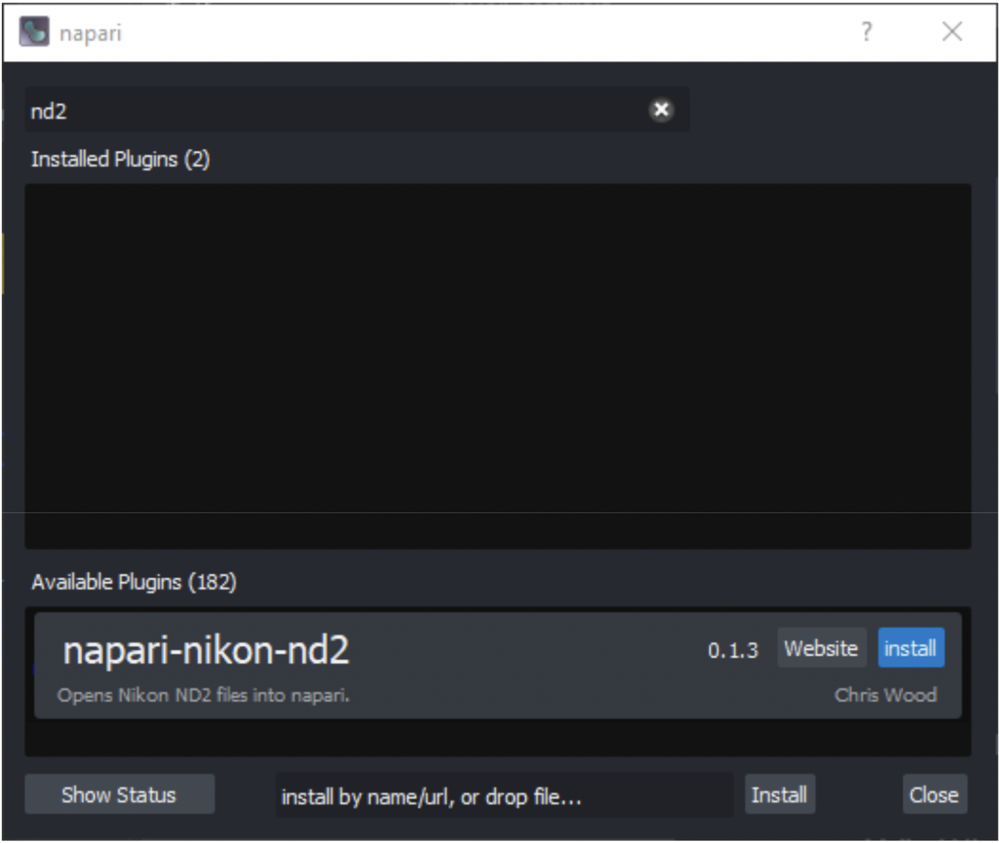

# Installing napari plugins

#### Pre-Requisites
Successful installation of napari (see [napari installation tutorial](https://chanzuckerberg.github.io/napari-segmentation-workshop/onboard/gettingstarted.html)).

## Overview of the napari hub

The reader is strongly encouraged to visit the [napari hub](https://www.napari-hub.org/) to browse available plugins and review their documentation to see if they are suited for your applications. Taking a few minutes to review options to ensure a plugin is right for your intended application can be invaluable in saving time later on. For example, some plugins have specific recommendations for how to install, which may be different from the steps outlined below.

## Plugin Installation Video Tutorial

Follow along with the video and reference the text below as needed. 

## Background
A user may ask why programs such as napari require plugins to accomplish certain functions, or add functionality.  There are many reasons for this, but two of the most common ones are:

- By providing a core viewer without plugins pre-installed, the program enjoys a so-called “light weight” installation, which minimizes the burden on user machines and keeps the viewer domain-agnostic. Each user can then tailor their napari installation with plugins that apply to their needs from the myriad of plugins available. 

- Plugins are dependent on associated files that come with their installation (e.g. a particular library). Several plugins may share such dependencies. However, it is not uncommon for the version of these dependencies to be different. For example, Plugin A may require the newest version of a particular library, but Plugin B may not be compatible with the latest version. This can be frustrating for users when too many plugins (and thus too many dependencies) have to be managed, so we recommend installing napari and plugins for each application in their own virtual environment to avoid incompatibilites with plugins for other applications.

Installation of plugins into napari is usually a very straightforward process. Please note that there is more than one way to install a plugin (GUI vs. command line, for example). We’ll cover the basics of the GUI-based installation, so prior coding knowledge is not required.

:::{hint} Note: It is always good to remember that with any open-source program with a constantly evolving repository of plugins, the relative “maturity” of a plugin can widely vary. For example, some plugins may be intuitive to install, use, and are well-documented, vs. others that are not.
:::

## Plugin Installation Tutorial

- Activate the virtual environment where you installed napari
  - For an environment called 'napari-env' use the command: **conda activate napari-env** 
- Launch napari
  -  Command: **napari** 
- Find the plugins menu item and click “Install/Uninstall Plugins…”

- The subsequent window will display plugins that are previously installed (top portion of the window), as well as a list of plugins that are available (lower portion).
- While the user is free to scroll through the list of plugins, it may be more efficient to type a keyword related to the function or plugin name they are looking for in the filter box (at top).

- Click install to begin installation of your desired plugins

:::{hint} Note: Just because a plugin has been installed, does not mean it has been enabled! To enable/disable, use the checkbox next to the plugin.
:::

### Example Case Study: Installing Plugins to Open Vendor-Specific File Types

- Let’s say you need to open a dataset acquired on a commercial system with a file type native to that particular system (e.g. Nikon .nd2, Zeiss .czi, Leica .lif, Olympus .oif, etc.)
- When attempting to drag one of these file types into the napari viewer, you notice the following error, alerting us that no current plugin exists to open the file:

- Heading to the Plugins menu and dialogue (see previous), let’s search for “nd2”.
- Here we see a plugin titled: “napari-nikon-nd2”, which seems appropriate.

- By clicking the blue “install” button to the right of it, we can add it to our list of installed plugins:
- Upon attempting to open the same [.nd2] dataset again, we are successful!

- Of course, not all plugin installations are perfect and may have either errors or bugs that pop up.  This is why it is important to visit [napari hub](napari-hub.org) and read the available documentation in order to review any suggested installation notes that would differ from the aforementioned.

### Updating Plugins

Periodically, updates to installed plugins may become available.  This will be displayed in the “Install/Uninstall Plugins” dialogue as seen below. Update your plugins as desired.

