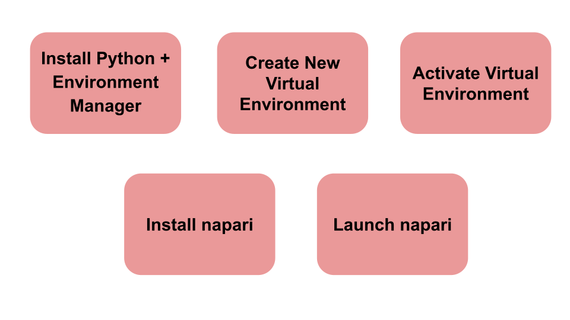
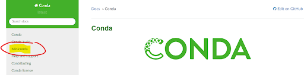
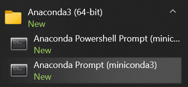

Getting started with napari and plugins
=======================
**By [Bryan Millis](https://chanzuckerberg.github.io/napari-segmentation-workshop/preface/whomadethis.html#bryan-millis) 🔬**
## Learning Objectives

In this lesson, you'll learn how to install napari with *minimal coding*, how virtual environments tie into installation, and how to find and install napari plugins. 

1.  [Installation flowchart](#installation-flowchart)
2.  [Background: Python and napari](#background-python-and-napari)
3.  [Background: Virtual environments and environment manager](#background-virtual-environments-and-environment-manager)
4.  [Video walkthrough](#video-walkthrough)
5.  [Install python + environment manager — miniconda](#install-python--environment-manager--miniconda)
6.  [Create a virtual environment](./gettingstarted-2.md#create-a-virtual-environment)
7.  [Activate virtual environment](./gettingstarted-2.md#activate-virtual-environment)
8.  [Install napari](./gettingstarted-2.md#install-napari)
9.  [How to launch napari after installation](./gettingstarted-2.md#launching-napari-after-installation-session)
10.  [Plugins overview](./gettingstarted-3.md)
11.  [How to install napari plugins](./gettingstarted-3.md#plugin-installation-tutorial)

- **Time to learn**: 1 hour

## Installation flowchart

An overview of the steps for installing napari in the recommended way, using an environment manager, is presented in the Video Walkthrough, below. An environment manager allows you to create multiple virtual environments, like separate sandboxes, on your computer for installing programs like napari, without affecting other parts of your system. Here is a visual example of a computer with 3 separate virtual environments, named **napari-cell**, **napari-env**, and **napari-clean**. Each one has a separate installation of napari along with one or more plugins. More on managing environments and installation follows.

## Background: Python and napari

Like every software package, napari is written in a programming language. For example, Windows is based in *C*, various statistics programs are written in *R*, and ImageJ is based on *Java*. Napari is written in a language called *Python*. 

Python is a widely popular scientific computing language with many years of contributions under its belt. There are multitudes of tools (and algorithms) that a program like napari can leverage to accomplish its tasks. Python does not always come pre-installed on computers, it must be manually installed in order to execute Python-based programs.  

Although this is likely to change in the future, there is no “quick install” of napari (and its requisite Python coding language). Here we walk through the steps to install an environment manager, Python and napari on your machine. This particular tutorial will focus on installing these on a Windows machine. 

## Background: Virtual environments and environment manager

There are several ways to install Python on your machine. For example, one could visit the [Python website](https://www.python.org/) to install just the Python language. Instead, we can install Python along with an **environment manager**, which is a recommended prerequisite for installing napari.  

The environment manager is called *miniconda* — a lightweight distribution of a bigger package called conda. Miniconda installs Python along with a few essential packages and is a **package manager** that enables creating and managing virtual environments. 

A virtual environment can be summed up as a contained place, or sandbox, where both a program and its various dependencies (i.e. other related files required for elements of a program to run) are installed. Having such a place available is extremely helpful, especially when using programs in active development, as environments can be created and deleted at will. If for example, there was a corruption, or bug that was hard to track down. You could simply delete the environment and continue in a new environment with a fresh install.

## Video walkthrough

Watch the video for exposure or follow the steps in the video and actually install everything along with the presentation. 

  

## Install python + environment manager — miniconda

- Visit the official [conda site](conda.io).
- Locate the appropriate link for miniconda.  
  **Note:** Mac users, please do not use the bash version. 

- Select the appropriate miniconda installation for your computer. In this example, the Windows 64-bit installation is highlighted. For Mac users, download the pkg file associated with your processor. (Check to see what your processor is by going to Apple menu > **About This Mac**.) For Intel processors, download the x86 file, and for ARM processors, download the Apple M1 file.  
**Important:** Avoid the bash versions.

:::{hint} 
Note the current version of Python that will be installed. Below, this is listed as *Python 3.9.7*. Links to install previous versions of Python are typically available further down the page.
:::

- Once the download has finished, run it. Default installation options are typically sufficient.
- The next steps for opening a terminal for installing napari differ for Mac and Windows users.  
    - For Windows users, click on the lower left Windows icon (Windows 10) and type **“anaconda…”** (in which case it will find "**Anaconda Prompt (miniconda3)"**), or scroll down to the anaconda folder and find the prompt there.  
    - For Mac users, simply open **terminal** using spotlight search.

- This launches the command prompt (Windows) or terminal (Mac) into the **base environment** (as denoted by **(base)** at the start of the command line). We'll use these terminals for creating virtual environments and installing napari.

:::{hint} 
If you plan on running napari on a regular basis, it may be handy at this point to create a shortcut to the Anaconda Prompt, or pin it to your taskbar, for easy access.
:::
