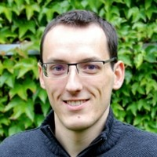

# Who made this course?

The napari cell segmentation course is an open-source, collaborative project created by premier imaging scientists from across the world and Chan Zuckerberg Intiative (CZI). The team, named the **Bravo Cohort**, co-created course materials aiming to enable imaging scientists to teach and researchers to learn how to use napari to solve segmentation problems. 

From January 2022- June 2022, imaging scientists partnered with a team of CZI application scientists, UX researchers, designers, and engineers to build the first set of minimal/no code learning resources for cell segmentation workflows in napari. The interdisciplinary, community-driven project explored the current challenges to teaching analysis methods, ideated on the attributes of an efficient/approachable/adaptable learning experience, and co-created the lessons on this site. The process and partnership will serve as a case study to help the CZI Imaging Tech team better understand how to support the continued creation of learning experiences that solve napari teaching and learning challenges.  

In the spirit of the open-source community, these materials may be [updated and contributed to](https://github.com/chanzuckerberg/napari-segmentation-workshop) much like napari itself, and will likely be iterated upon as video production, plugin functionality, and the napari platform evolves over time. 

## Contributors to course

### Bryan Millis

 
*Vanderbilt, Vanderbilt Biophotonics Center*
 
Author of ["Getting started with napari"](https://chanzuckerberg.github.io/napari-segmentation-workshop/onboard/gettingstarted.html)

### Caron Jacobs

 
*University of Cape Town, IDM/CIDRI-Africa*
 
Author of ["What is napari?"](https://chanzuckerberg.github.io/napari-segmentation-workshop/onboard/whatisnapari.html)

### Frederic Bonnet

 
*MDIBL, Light Microscopy Facility*
 
Author of ["Cellpose-napari + FIJI"](https://chanzuckerberg.github.io/napari-segmentation-workshop/workflow/cellpose.html)

### Feather Ives

 
*UC Berkeley, Molecular Imaging Center*

### Katarzyna "Kasia" Kedziora

 
*UNC Chapel Hill, Genetics Department*
 
Author of ["Classical segmentation with PartSeg"](https://chanzuckerberg.github.io/napari-segmentation-workshop/workflow/partseg.html)

### Kitty Lee

 
*Stanford, Cell Sciences Imaging Facility*

### Praju Anekal

 
*Harvard Medical School, Microscopy Resources*
 
Author of ["Allen Cell Segmenter"](https://chanzuckerberg.github.io/napari-segmentation-workshop/workflow/allencell.html)

## About napari

Led by microscopy and Python experts and built by a growing community, [napari](napari.org) is quickly becoming an essential tool for visualizing and exploring imaging data. napari is a consensus-based community project and an open source tool that enables high performance visualization and exploration of a broad range of imaging data, including microscopy, medical imaging, geospatial data, and more, with a clearly defined [governance model, mission, and values](https://napari.org/community/governance.html). CZI [supports development of open source and community run tools](https://chanzuckerberg.com/eoss/) like napari as part of its mission to accelerate biomedical research and help every scientist make progress faster. You can learn more about the napari project by visiting [napari](napari.org).

## About CZI 

The [CZI Imaging Program](https://chanzuckerberg.com/science/programs-resources/imaging/) seeks to remove barriers in the analysis of imaging and microscopy data and make it easier for biologists to access emerging methods for bioimage analysis that leverage machine learning. CZI sees promise in napari and seeks to assist its development by providing resources not always available to the open source community, including dedicated user research, design, and engineering support. CZI is proud to collaborate with the science community to accelerate research and enable open science for all. In addition to [napari](https://napari.org/stable/) and the [napari hub](https://www.napari-hub.org/), CZI imaging supports a number of grants on key areas such as visual proteomics, deep tissue imaging, and expanding global access. You can learn more about the imaging program and grant resources [here](https://czi.co/Imaging). 
