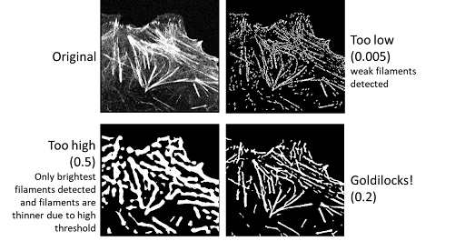

# Explanation of parameters and their effects

:::{note}
The example below pertains to the segmentation of *actin filaments*. Your options will vary depending on the [classical segmentation workflow](https://chanzuckerberg.github.io/napari-segmentation-workshop/workflow/allencell-protocol.html#step-3-select-a-comparable-reference) chosen within the Allen Cell napari plugin.
:::

#### Pre-processing: Intensity normalization

Intended for scaling the intensity of the image between 0-1. The parameters are **scaling_param 1** and **scaling_param 2**. These set the range from the **mean image intensity** to **normalised**. 

The mean image intensity is calculated for the image; then scaling_param 1 and 2 are subtracted or added to the mean, setting a range that will be scaled from 0-1. 

Parameters here will decide how much of the histogram you want to exclude as being too bright (i.e. too many dead cells), etc. 

:::{hint}
Values dependent on the image mean value and intensity skew in the image itself. 
:::

#### Pre-processing: Edge preserving smoothing

An image is smoothed to reduce noise. No parameters are required.

#### Core segmentation: Sigma

**Sigma** allows you to set the expected thickness of filaments. Smaller values lend themselves to *thinner filaments*; while larger values are best used with *thicker filaments*. 

#### Core segmentation: Cutoff

**Cutoff** allows you to set the threshold for the image. 

#### Post-processing

**Size filtering** can be used to remove spurious segmentations. You can link segmentations in 2D or 3D using the **connecting pixels** controls. 

:::{note}
If you find in using this plugin that you have quite disparate structures, the **same workflow can be run twice** to segment different populations within your data.
:::
