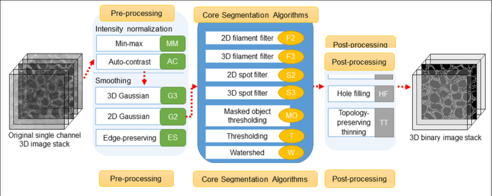

Allen Cell Segmenter
=======================
**By [Praju Anekal](https://chanzuckerberg.github.io/napari-segmentation-workshop/preface/whomadethis.html#praju-anekal) 🔬**
## Learning Objectives  

In this lesson, you'll learn how to use and configure the Allen Cell Segmenter napari plugin to complete a segmentation workflow. The lesson includes:

1.  [A walkthrough of the segmentation protocol](allencell-protocol.md)
2.  [An explanation of parameters and effects for *actin filaments* segmentation](allencell-parameters.md) 

- **Time to learn**: 1 hour

## Prerequisites

| 
Napari version and plugins
| Importance | Notes |
|--------------------------- | ---------- | ----- |
| [napari v 0.4.17](https://chanzuckerberg.github.io/napari-segmentation-workshop/onboard/lesson3.html) | Mandatory  | In the napari viewer, verify your version of napari by clicking on the **Help** menu, then **napari info**. | |
| [napari-allencell-segmenter v 1.1.4](https://www.napari-hub.org/plugins/cellpose-napari) | Mandatory <td>Install this plugin from within the napari viewer: <li>Go to the **Plugin** menu <li> Click **Install/uninstall plugins**.</li> <li  style="margin-left:2em">Search for *napari-allencell-segmenter* </li> <li style="margin-left:2em"> Click **install**. </li> If the install is not successful, resist the urge to attempt to reinstall it from the menu. Pip install it instead. <li> Open a terminal or console prompt </li> <li> Enter `python -m pip install napari==0.4.xx` where xx is the desired version of napari.</li> </ul> </td>
| 
**Image inputs**
 |  |  |
| Image stack (3D data: 8, 12, and 16 bit) | Mandatory  | In some cases, the plugin may return error messages when the image scale is imported incorrectly. If this occurs, remove any pixel scaling before repeating this step. | |
| 
**Sample data**
 |  |  |
| [Sample data used in lesson](https://github.com/chanzuckerberg/napari-segmentation-workshop/raw/main/content/workflow/images/Allen-Cell-Segmenter-Sample-Data.tif) | *Optional* | Although napari may support importing other file types, this sample image is a tiff. | |

## What does this plugin do?

The Allen Cell Segmenter consists of a *pre-designed* classical image segmentation workflow for many types of cellular components and **3D data** sets. 

The plugin workflow itself is broken into 3 discrete parts, (please see graphic at the top of this article):
- **Preprocessing** 
- **Segmentation**  
- **Post processing**

It allows you to select your workflow from a library of images, choosing whichever image most resembles your data. You can then adjust parameters within the workflow steps to optimize the segmentation quality of the data that results. 

Once segmentation is completed, Allen Cell outputs a segmented mask which can be analyzed by another napari plugin (e.g. [PartSeg](https://www.napari-hub.org/plugins/PartSeg)). 

:::{note}
Beyond these basic functions, Allen Cell Segmenter also has an **[iterative deep-learning](https://www.youtube.com/watch?v=W1DPfZk5iF8&t=8s)** component based on user-trained pixel classification (which is not within the scope of this lesson).
:::

## Demo of *Allen Cell Segmenter*  
The following video demonstrates how to use the Allen Cell Segmenter plugin.  

**Note:** To change the speed of the video, click the cog wheel in the lower right corner, then *speed*, and select the desired speed. 

A more detailed description of the protocol is given in the [Protocol for segmentation workflow](\allencell-protocol.md) article. A summary of the basic steps is:
- Drag and drop your image into napari or open it from the **File** menu.  
- Use the slider bar at the bottom of the screen to choose the part of the image to examine.  

- Adjust the speed at which the image is displayed by right clicking the play button at the left end of the playback bar:  and choosing the number of frames/second to display down to one frame/second.  
- After pausing playback, you can move one frame at a time by clicking the  or  buttons at either end of the playback bar. 
- Ensure you have already installed the napari-allencell-segmenter plugin. 
- Load the napari-allencell-segmenter plugin Workflow editor.  
(**Plugins**>**napari-allencell-segmenter**>**Workflow editor**)  
A panel appears on the right side of the screen with a selection of images. 
  - Change option 2 to *Channel 0*.
  - Choose the image that most closely matches the one you are examining. The panel now shows options for **Preprocessing**, **Core**, and **Postprocessing**.  
  - Preprocessing  
    1. Intensity Normalization - select scaling_param 1 and scaling_param 2.    
    2. Edge Preserving Smoothing - no parameters needed. 
  - Core  
    3. Filament Filter 3D  
       - sigmas  
       - cutoff
  - Postprocessing  
    4. Size Filter  
       - min_size  
       - method  
  - You can run your workflow and then save it. 
<!--I would put the next article before this one. That way they can read about the process and then the demo video would make more sense. --> 

 
  
The above video demonstrates how to complete the [Allen Cell segmentation workflow](allencell-protocol.md) within napari, and showcases how adjusting parameters affects the resulting segmentation.

## Supporting materials

- [Original Python code](https://www.allencell.org/segmenter.html#lookup-table)

- [“The Allen Cell Structure Segmenter: a new open source toolkit for segmenting 3D intracellular structures in fluorescence microscopy images”](https://www.biorxiv.org/content/10.1101/491035v1.full#F2)

- [Github documentation for Allen Cell Segmenter](https://github.com/AllenCell/napari-allencell-segmenter)

- [A detailed explanation of Allen Cell parameters](https://github.com/AllenCell/aics-segmentation/blob/main/lookup_table_demo/playground_filament3d.ipynb)

## Advanced materials 

[Detailed video on the algorithms behind the Allen Cell Segmenter](https://www.youtube.com/watch?v=Ynl_Yt9N8p4)
