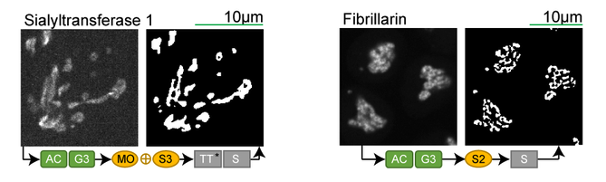

Allen Cell Segmenter
=======================

## Learning Objectives

In this lesson, you'll learn how to use and configure the Allen Cell Segmenter plugin for napari to complete a segmentation workflow.

1.  
2.  
3.  

- **Time to learn**: 1 hour

## Prerequisites

| Napari version and plugins                                                                     | Importance | Notes |
| -------------------------------------------------------------------------------- | ---------- | ----- |
| [napari v 0.4.14](https://chanzuckerberg.github.io/napari-segmentation-workshop/onboard/lesson3.html) | Mandatory  | In the napari viewer, verify your version of napari by clicking on the **Help** menu, then **napari info**. | |
| [napari-allencell-segmenter v 1.1.4](https://www.napari-hub.org/plugins/cellpose-napari) | Mandatory  | Install this plugin from within the napari viewer, by going to the **Plugin** menu, then clicking on **Install/uninstall plugins**. Search for *napari-allencell-segmenter* and click **install**. | |
| 
**Image inputs**
 |  |  |
| (8, 12, and 16 bit) | Mandatory  | In some cases, the plugin may return error messages when the image scale is imported incorrectly. When this occurs, remove any pixel scaling before repeating this step. | |
| 
**Sample data**
 |  |  |
|  | *Optional* |  | |

## What does this plugin do?

The Allen Cell Segmenter is a napari plugin that consists of a **pre-designed** classical image segmentation workflow** for many cellular components. It has optimized classical segmentation workflow steps for different types of segmentation problems. You can choose which images most resemble your data and adjust parameters within the workflow steps to optimize the segmentation quality on your data.

## Demo of *Allen Cell Segmenter*

 
  
The above video demonstrates...

## Supporting materials

- [Original Python code](https://www.allencell.org/segmenter.html#lookup-table)

- [“The Allen Cell Structure Segmenter: a new open source toolkit for segmenting 3D intracellular structures in fluorescence microscopy images”](https://www.biorxiv.org/content/10.1101/491035v1.full#F2)

- [Github documentation for Allen Cell Segmenter](https://github.com/mouseland/cellpose)

- [A detailed explanation of Allen Cell parameters](https://github.com/AllenCell/aics-segmentation/blob/main/lookup_table_demo/playground_filament3d.ipynb)
