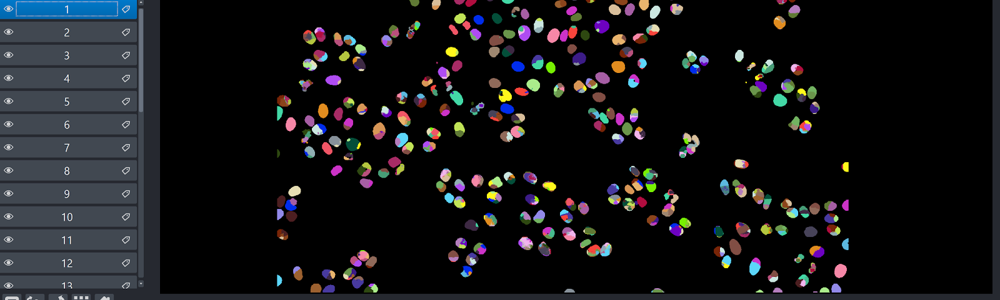

# Segmenting in napari, and exporting a mask in FIJI  

## Workflow for 2D Segmentation

* Go to the Plugins dropdown and select *cellpose-napari*.
* Open your image in the napari viewer. 
* Select the appropriate [cellpose parameters](cellpose-parameters.md) from the options on the right side of the screen on the *cellpose-napari* panel. Be sure to uncheck **Process stack as 3D**.
* Click the bar at the bottom of the *cellpose-napari* panel to run the segmentation.

## Workflow for 3D Segmentation

* Go to the Plugins dropdown and select *cellpose-napari*.
* Open your image in the napari viewer. 
* Select the appropriate [cellpose parameters](cellpose-parameters.md). Be sure to check **Process stack as 3D** OR use the **stitch threshold slices** option.
* Click the bar at the bottom of the *cellpose-napari* panel to run the segmentation.

## Workflow for Time segmentation

* Go to the Plugins dropdown and select *cellpose-napari*.
* Open your image in the napari viewer.  
* Select the appropriate [cellpose parameters](cellpose-parameters.md) Be sure to use the **stitch threshold slices** option with value > 0.
* Click the bar at the bottom of the *cellpose-napari* panel to run the segmentation.

## Export mask as TIF

Convert the **label layer** into an image by right clicking on it and selecting: **Convert to Image**. Proceed to split this image into individual images by right clicking and selecting **Split Stack** (3D and time Series only). Then reconvert each image into a label by right clicking on it and selecting: **Convert to label**. Rename them as makes sense to you (**e.g.** 1-12). Finally, save each label as a tif.

 

## Opening the mask in FIJI

Use the plugin Bio Format importer and select: **group file with similar name** (3D and time Serie only). In the pop-up window, select: **pattern**. Open normally for 2D mask. You will be able to display the raw image and the mask image side by side.

## Using the mask as a mask

Navigating to the main menu in FIJI, go to **process > binary > convert to mask > Yen**.

 

Performing this Binarization step can also correct some segmentation issues that may arise. As we can see in the example above, cells were oversegmented with *cellpose-napari*, but binarization in FIJI corrects this. <!-- I don't know what the following images are supposed to illustrate. -->

 

## Performing a 3D analysis

<iframe width="560" height="315" src="https://www.youtube.com/embed/RCat0ylcSHw" title="YouTube video player" frameborder="0" allow="accelerometer; autoplay; clipboard-write; encrypted-media; gyroscope; picture-in-picture" allowfullscreen></iframe>

 

In FIJI, you may perform a 3D analysis of your image's mask in one of two ways, as shown in the video above: 

* Analyze > 3D OC options > select measurements option
* Analyze > 3D object counter > fine tune if necessary 

 

<!-- I don't know what the previous images are supposed to illustrate. -->
